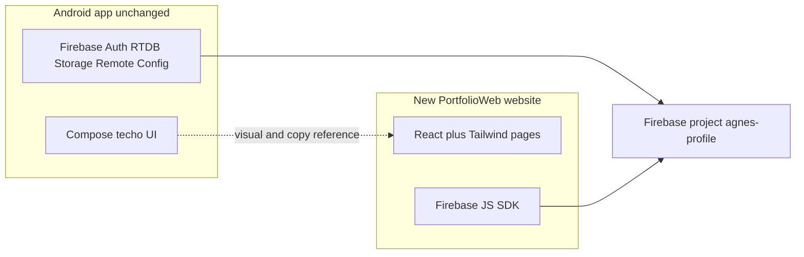

# Cross-project techo portfolio website

The product is a **website** you open in the browser. **React.js** is the UI library (with Tailwind for CSS), not a second mobile app. Vite compiles it to HTML/CSS/JS you can host like any site.

Keep the Android app as-is. Add a new website beside it, then switch this chat to a **multi-root workspace** so both trees stay open: [Portfolio](/Users/agnes/Documents/Portfolio) (reference) and a new [PortfolioWeb](/Users/agnes/Documents/PortfolioWeb) (implementation).

## Workspace setup

1. Create `/Users/agnes/Documents/PortfolioWeb` with `create_project` (its own git repo).
2. Switch the agent root to both paths so screens, colors, and copy can be read from Android while files are written only in the web repo.
3. Scaffold **Vite + React + TypeScript + Tailwind CSS v4 + React Router**. TypeScript maps onto the Kotlin models; the output is a website, not an installable app.

Do **not** put a `web/` folder inside the Android repo, and do **not** edit Kotlin/Gradle unless you later ask to.

## Firebase (same backend, web client)

Content stays live in Firebase (`WorkingExperience`, `Education`, `Portfolio` trees, Storage cover/gallery paths, Remote Config `master_login` / `master_account_info`). The Android client in [app/google-services.json](app/google-services.json) is Android-only.

**You will need to add a Web app in the Firebase Console** for project `agnes-profile` and paste the config into `PortfolioWeb/.env.local` (gitignored):

- `apiKey`, `authDomain`, `databaseURL`, `projectId` (`agnes-profile`), `storageBucket` (`agnes-profile.appspot.com`), `messagingSenderId`, web `appId`
- Authorized domains: `localhost` for local Vite, plus your host later

Web flow matches Android:

- Splash: sign out, fetch Remote Config (no Play Services check)
- Login: email/password Auth, then load RTDB + Storage download URLs
- Master: passcode dialog, AES-CBC decrypt of Remote Config password/passcode using the same key/IV as [ConfigRepository.kt](app/src/main/java/com/agnes/portfolio/data/repository/ConfigRepository.kt) (`AES_KEY` UTF-8 bytes, zero IV)
- Logout: confirm dialog, sign out, back to login

**Skip on web:** biometric login, screenshot share to gallery, Crashlytics.

## Techo visual system (Tailwind, not a generic Material clone)

Port tokens from [Color.kt](app/src/main/java/com/agnes/portfolio/ui/theme/Color.kt) into Tailwind theme (`#FDFBF7` paper, `#D2E5EE` mist blue, `#A59ACA` wisteria, `#E8D9B0` / `#C5D1C3` cards, `#E2877B` YouTube coral, `#4A403A` ink). Load **Zen Maru Gothic** from Google Fonts.

Shared components (mirroring Compose helpers):

- Full-page **grid paper** background
- **Sticker card** (12px radius, white border, slight rotate, paper shadow)
- **Sticky-note title** (sharp corners, adhesive strip, folded corner)
- **Washi tape** strip on Home pager cards
- Dialogs, text fields, chips, and **top nav** in techo greys (not default blue buttons)

**Desktop website layout** (not a phone-width clone):

- Grid paper fills the viewport; content uses a wider max width (~1100–1200px)
- **Top navigation** after login: Home, Projects, Experience, Education, YouTube, More (About / Contact / logout)
- Home shows the three sticker cards **in a row** (Portfolio / Working Exp / Education), not a swipe pager
- On a phone, the same pages stack and the top nav collapses to a menu — no Android-style bottom tab bar

## Screens and routes

Same destinations as [AppNav.kt](app/src/main/java/com/agnes/portfolio/ui/navigation/AppNav.kt) / [AppRoute.kt](app/src/main/java/com/agnes/portfolio/ui/navigation/AppRoute.kt):

| Route                | Behavior                                                                                                                                                         |
| -------------------- | ---------------------------------------------------------------------------------------------------------------------------------------------------------------- |
| `/` splash           | Config fetch, then login                                                                                                                                         |
| `/login`             | Email/password, MASTER, version caption (centered notebook card)                                                                                                 |
| `/home` after login  | Top nav + three sticker cards in a row → projects / experience / education                                                                                       |
| `/youtube`           | Static [YoutubeChannelContent.kt](app/src/main/java/com/agnes/portfolio/ui/youtube/YoutubeChannelContent.kt); videos open YouTube iframe (not the native player) |
| `/more`              | About, Contact, account email, logout                                                                                                                            |
| `/projects`          | Filter by year + type; sticker list cards                                                                                                                        |
| `/project/:itemId`   | Cover, description, further info, skill icons, videos                                                                                                            |
| `/gallery/:itemId`   | Storage gallery images                                                                                                                                           |
| `/experience`        | Yellow sticky bar + tabs (`fintech` / `music education` / `event` / `media`)                                                                                     |
| `/education`         | Sage sticky rows                                                                                                                                                 |
| `/about`, `/contact` | Copy from [strings.xml](app/src/main/res/values/strings.xml); contact from Remote Config; QR via a small QR library                                              |

Data layer: Firebase modules + a snapshot store (React context) equivalent to `PortfolioRepository` — UI never talks to Firebase directly.

## Assets copied from Android (reference only)

Copy into `PortfolioWeb/public` (do not move them out of Android):

- `about_me` photo, bottom-nav / contact / YouTube / Instagram / Facebook icons
- Skill-set vector drawables used by `SkillMarksView` (Unity through Digital Payment) as SVG
- English + YouTube Traditional Chinese strings

## Verification

Run `npm run dev` and walk the real flow in the browser: splash → login → home cards → projects/detail/gallery → education → working exp tabs → YouTube tags/embed → About/Contact/logout. Check a desktop width (top nav, cards in a row) and a ~390px phone width (stacked layout, collapsed nav).

## Out of scope for this pass

Android code changes, Firebase Console registration (your step), production deploy, biometric/WebAuthn, screenshot sharing.
